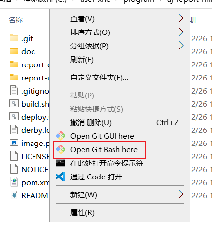

# aj-report-mine
在源代码v1.4版本基础上，本地进行前后端分离部署开发
这里我是进行了整合，把自己在拉取源代码到成功运行过程中的一些东西直接整合，根据下面的步骤即可成功运行

# 资源获取
夸克网盘(16-github-aj-report-requires)：https://pan.quark.cn/s/b64d4d424196
迅雷网盘：https://pan.xunlei.com/s/VOF1q58T3734nwZx4b5SzXMlA1?pwd=nkqj#

# 环境准备工作
代码拉取：
1. git

后端部分：
1. jdk1.8
2. maven
3. mysql 8.0
4. 数据库连接工具（navicat16）

前端部分：
1. nvm(直接安装这个控制nodejs版本)
2. nodejs v14.16.0

环境安装好之后，检查相应的环境变量是否已添加到系统
右键我的电脑，属性，高级系统设置，环境变量
大致如图：

注： node安装之后应该会自动添加环境变量，我这里截取的是jdk和maven的，这两个我安装后是手动添加的，最好检查一下
打开cmd:
1. java -version  输出 java version "1.8.0_301"
2. node -v 输出 java version "1.8.0_301"
3. echo %JAVA_HOME% 输出 你的环境变量配置位置
4. echo %MAVEN_HOME% 输出 你的环境变量配置位置

# 数据库准备以及相关代码修改
1. 环境好了之后，先拉取代码，初始结构如图

2. navicat16进入后创建一个 名为：localhost 的本地连接
相关数据：
主机：localhost
端口：3306
用户：root
密码：root

3. 修改代码，通过代码编辑软件打开 拉圈的项目根目录，
然后到 根 -> report-core -> src -> main -> assembly -> bin -> start.bat 修改如图：
将JAVA_HOME 改为自己java的环境变量地址即可

然后到 根 -> report-core -> src -> main -> resources -> bootstrap.yml  修改如图：
将配置改为自己的mysql设置

# 操作一，整体直接打包运行
1. 可以直接 在项目右键，打开git,输入 sh build.sh 此时进行项目的压缩打包

2. 此时，在build文件夹会生成一个压缩包如图：

3. 解压，运行bat文件（双击）

如图界面即正在运行：

4. 浏览器访问： localhost:9095 即可

# 操作二 前后端分离
1. 后端 直接在控制台终端cd到 report-core，然后运行代码：mvn clean package
 
 

 成功后可以看到这样一个压缩包：
 

 解压之后使用方法找到内部的 .bat文件双击运行即可，
 

 2. 前端 直接在控制台终端cd到 report-ui，然后运行代码：npm install 安装前端相关依赖
之后运行： npm run dev 等待成功会自动打开浏览器窗口

# 结束
以上就是我的两种打开 aj-report 大屏项目的方式
原始版本在：github.com/anji-plus/report 感兴趣的可以前往自行研究
